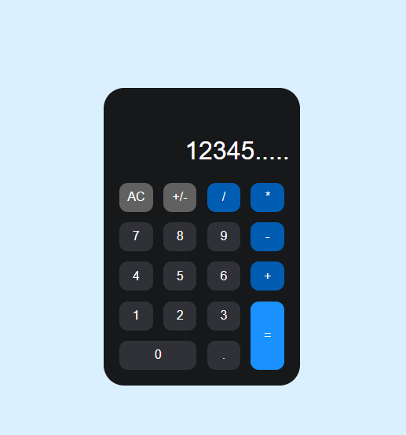

<h1 align="center">

</h1>
 
 
 
<h1 align="center"> Calculadora com CSS Display GRID + Javascript  </h1>

Calculadora desenvolvida acompanhando as lives feitas pelo <a target="_blank" href="https://www.instagram.com/rodolfomorii/">Rodolfo Mori</a> do DevClub.

 

<h1 align="center">Projeto desenvolvido com as seguintes tecnologias:</h1>
 
 

 
 
<h1 align="center">

</h1>
